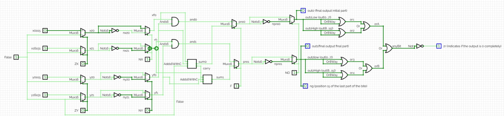

# Primer Parcial | Organización de Computadores

## Índice
1. [Parte 1 de la entrega: ALU de 32 bits](#parte-1-de-la-entrega-alu-de-32-bits)
   1. [Diagrama de Circuito](#diagrama-de-circuito)
   2. [Pasos de ejecución](#pasos-de-ejecución)
2. [Parte 2 de la entrega: ALU de 3 entradas](#parte-2-de-la-entrega-alu-de-3-entradas)
   1. [Diagrama de Circuito](#diagrama-de-circuito-1)
   2. [Pasos de ejecución](#pasos-de-ejecución-1)
3. [Autores](#autores)
4. [Información del curso](#información-del-curso)

## Parte 1 de la entrega: ALU de 32 bits

`ALU32.hdl` extiende la ALU estándar de Hack (16 bits) a 32 bits, reutilizando el mismo juego de señales de control `zx, nx, zy, ny, f, no`, pero aplicadas a **una sola instrucción sobre los 32 bits completos**, no a dos mitades independientes.

### Límite de 16 bits del simulador

El Hardware Simulator no permite puertos de más de 16 bits, así que `X` y `Y` de 32 bits se parten cada una en dos entradas de 16:

```hdl
IN  x0a15[16], x16a31[16], y0a15[16], y16a31[16],
    zx, nx, zy, ny, f, no;
OUT out1[16], out2[16],
    zr, ng;
```

`x0a15`/`y0a15` son la mitad baja y `x16a31`/`y16a31` la mitad alta. La salida se entrega igual, partida en `out1` (bits 0-15) y `out2` (bits 16-31).

### Preprocesamiento de X e Y

Los controles `zx, nx, zy, ny` se aplican **por igual a ambas mitades**, duplicando la lógica de Mux16/Not16 una vez por mitad:

```hdl
// Preprocesamiento X, independiente por mitad
Mux16(a=x0a15,  b=false, sel=zx, out=xz0);
Mux16(a=x16a31, b=false, sel=zx, out=xz1);
Not16(in=xz0, out=nxz0);
Not16(in=xz1, out=nxz1);
Mux16(a=xz0, b=nxz0, sel=nx, out=xf0);
Mux16(a=xz1, b=nxz1, sel=nx, out=xf1);
```

Lo mismo ocurre con `Y` usando `zy`/`ny`, generando `yf0` (mitad baja) y `yf1` (mitad alta).

### Selección Add/And con `f` y el carry entre mitades

El AND bit a bit no necesita carry, así que se calcula por separado en cada mitad con `And16`. La suma sí lo necesita: **`Add16WithC` es el único punto donde las dos mitades de 16 bits se conectan entre sí**, a través del bit de acarreo (`cout`/`cin`):

```hdl
Add16WithC(a=xf0, b=yf0, cin=false, out=sum0, cout=carry);
Add16WithC(a=xf1, b=yf1, cin=carry, out=sum1, cout=coutFinal);

Mux16(a=and0, b=sum0, sel=f, out=pre0);
Mux16(a=and1, b=sum1, sel=f, out=pre1);
```

La mitad baja suma con `cin=false`; el `cout` de esa suma entra como `cin` de la mitad alta, propagando el acarreo. `f` selecciona AND o suma para cada mitad de forma simétrica.

### Negación final con `no`

Igual que en la ALU de 16 bits, `no` decide si la salida se invierte, bit a bit y sin carry entre mitades:

```hdl
Not16(in=pre0, out=npre0);
Not16(in=pre1, out=npre1);
Mux16(a=pre0, b=npre0, sel=no, out=out1, out[0..7]=out1Low, out[8..15]=out1High);
Mux16(a=pre1, b=npre1, sel=no, out=out2, out[0..7]=out2Low, out[8..15]=out2High, out[15]=ng);
```

### Cálculo de `zr` y `ng`

`ng` se toma directamente del bit 15 (bit de signo) del segundo Mux16, que corresponde al bit más significativo de los 32 (`out2[15]`). `zr` exige que **las 32 posiciones** estén en cero, combinando los 4 bytes de `out1`/`out2` con `Or8Way` y `Or`:

```hdl
Or8Way(in=out1Low,   out=or0);
Or8Way(in=out1High,  out=or1);
Or8Way(in=out2Low,   out=or2);
Or8Way(in=out2High,  out=or3);
Or(a=or0, b=or1, out=orA);
Or(a=or2, b=or3, out=orB);
Or(a=orA, b=orB, out=anyBit);
Not(in=anyBit, out=zr);
```

### Diagrama de Circuito



### Pasos de ejecución

1. Cargar `ALU32.hdl` en el Hardware Simulator (Nand2Tetris).
2. Setear `x0a15`, `x16a31`, `y0a15`, `y16a31` con los 32 bits de X e Y, partidos en las dos mitades.
3. Setear `zx, nx, zy, ny, f, no` según la operación deseada.
4. Ejecutar (Eval).
5. Leer la salida en `out1` (bits 0-15), `out2` (bits 16-31) y las banderas `zr`, `ng`.

## Parte 2 de la entrega: ALU de 3 entradas

`ALU3Inputs.hdl` implementa una ALU de 16 bits con **tres** entradas (`x`, `y`, `z`) controlada por un opcode directo `op[3]`, en vez del esquema de 6 señales de control (`zx/nx/zy/ny/f/no`) de la ALU estándar.

### Tabla de operaciones

`op` selecciona una de 8 salidas intermedias a través de un `Mux8Way16`, en este orden literal:

| `op[3]` | Salida | Expresión |
| --- | --- | --- |
| `000` | `out0` | `X + Y + Z` |
| `001` | `out1` | `(X + Y) - Z` |
| `010` | `out2` | `(X AND Y) OR Z` |
| `011` | `out3` | `(X OR Y) AND Z` |
| `100` | `out4` | `X AND Y AND Z` |
| `101` | `out5` | `X OR Y OR Z` |
| `110` | `out6` | `X XOR Y XOR Z` |
| `111` | `out7` | `(X AND Y) OR (X AND Z) OR (Y AND Z)` |

```hdl
Mux8Way16(a=out0, b=out1, c=out2, d=out3, e=out4, f=out5, g=out6, h=out7, sel=op,
           out=out,
           out[0..7]=resultLow,
           out[8..15]=resultHigh,
           out[15]=ng);
```

### Reutilización de `addXY`, `andXY`, `orXY`, `xorXY`

Las combinaciones de X con Y se calculan **una sola vez** al inicio del chip y se reutilizan en varias de las 8 operaciones, evitando duplicar compuertas:

```hdl
Add16(a=x, b=y, out=addXY);
And16(a=x, b=y, out=andXY);
Or16(a=x, b=y, out=orXY);
Xor16(a=x, b=y, out=xorXY);
```

`addXY` alimenta `out0` y `out1`; `andXY` alimenta `out2`, `out4` y `out7`; `orXY` alimenta `out3` y `out5`; `xorXY` alimenta `out6`.

### Resta: `(X + Y) - Z`

Hack no tiene una compuerta de resta nativa. `out1` se obtiene por complemento a 2 de `Z` (invertir + 1) y sumando ese negativo a `addXY`:

```hdl
Not16(in=z, out=notZ);
Inc16(in=notZ, out=negZ);
Add16(a=addXY, b=negZ, out=out1);
```

### Por qué se usa `Mux8Way16` con opcode directo, no `zx/nx/zy/ny/f/no`

El esquema de 6 señales de la ALU estándar de 16 bits está diseñado para **dos** entradas (X, Y): preprocesa cada una por separado y luego elige entre AND o suma. Con **tres** entradas (X, Y, Z) ese esquema no alcanza a expresar combinaciones de tres operandos (p. ej. `X AND Y AND Z` o el mayoritario `out7`) sin encadenar múltiples pasadas de preprocesamiento. Por eso se optó por precalcular las 8 combinaciones relevantes de X, Y, Z como cables independientes (`out0`...`out7`) y seleccionar una con un opcode de 3 bits (`op`) vía `Mux8Way16`, que es más directo y explícito para un espacio de operaciones fijo y pequeño.

### Cálculo de `zr` y `ng` después del mux

`ng` se toma del bit 15 de la salida del `Mux8Way16` (`out[15]=ng`, dentro de la misma llamada). `zr` combina los dos bytes de la salida final (`resultLow`, `resultHigh`) con `Or8Way` y `Or`:

```hdl
Or8Way(in=resultLow,  out=anyLow);
Or8Way(in=resultHigh, out=anyHigh);
Or(a=anyLow, b=anyHigh, out=anyBit);
Not(in=anyBit, out=zr);
```

### `Xor16` construido manualmente

El proyecto base de Nand2Tetris no incluye un `Xor16` builtin, así que se construyó bit a bit encadenando 16 compuertas `Xor`:

```hdl
CHIP Xor16 {
    IN a[16], b[16];
    OUT out[16];

    PARTS:
    Xor(a=a[0],  b=b[0],  out=out[0]);
    Xor(a=a[1],  b=b[1],  out=out[1]);
    // ... hasta out[15]
}
```

### Diagrama de Circuito


### Pasos de ejecución

1. Cargar `ALU3Inputs.hdl` en el Hardware Simulator (Nand2Tetris).
2. Setear `x`, `y`, `z` con los valores de 16 bits deseados.
3. Setear `op[3]` con el opcode de la operación a probar (ver tabla).
4. Ejecutar (Eval).
5. Leer la salida en `out` y las banderas `zr`, `ng`.

## Autores

**Mateo Montoya Ospina** <br>
**Miguel Colorado Castaño** <br>
**Sebastián Andrés Ibarra Prada**

## Información del curso
**Curso:** Organización de Computadores <br>
**Profesor:** Edison Valencia Díaz
